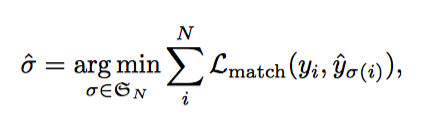

# End-to-End Object Detection with Transformers (DETR)

### 0. Basic info

* **RATING:  5**
* [colab](https://colab.research.google.com/github/facebookresearch/detr/blob/colab/notebooks/detr_demo.ipynb#scrollTo=u2KaiuHa8bUD) / [github](https://github.com/facebookresearch/detr) 
* Published by Facebook AI on 2020.5.26, **opensourced** both training code & pretrained model
* The new proposed approach can get comparable result with Faster-RCNN on coco dataset.
* Faster than Faster-RCNN
* Date: 2020/06/01, worth reading again

### 1. What did authors try to accomplish?

- Author proposed a new method that view object detection as **a direct set prediction problem** (Not understand what this mean).
- Their approach streamlines the detection pipeline, **no need mns/anchor or other hand-designed components**.
- Given a fixed small set of learned object queries, **DETR reeasons about the relations of the objects and the global image context to directly output the  final set of predictions in parallel**.
- Can be easily generalized to produce panoptic segmentation in a unified manner.

### 2. What were the key elements of the approach?

* **A set based global loss** that forces unique predictions via bipartite matching
* **A transormer encoder-decoder architecture**: a popular architecture for sequence prediction.
* **Object Detection set prediction loss**: 

* DETR architecture
  * A CNN backbone to extract a compact feature representation. out shape: *(2048, H/32, W/32)*
  * An encoder-decoder transformer. 
    * input shape: (1,256,25,43)
    * output shape: (1, 100, 256)
  * A simple feed forward network that makes the final detection prediction.

### 3. What can you use yourself?

* Whole pipeline maybe usefull in the future
* The thought of pair loss is very powerful, can utilize it in instance segmentation (paper 47)
* Transformer maybe usefull in the future

### 4. What other reference do you want to fellow?

* Main:
  * 47: Attention is all  you need
  * 43: End to end people detection in crowede scenes
  * 39: Learn to predict sets with unknownpermutation and cardinality using deep neural networks
* Others:
  * Recurrent instance segmentation: 30/36/41/42
  * Learning NMS: 4/16

